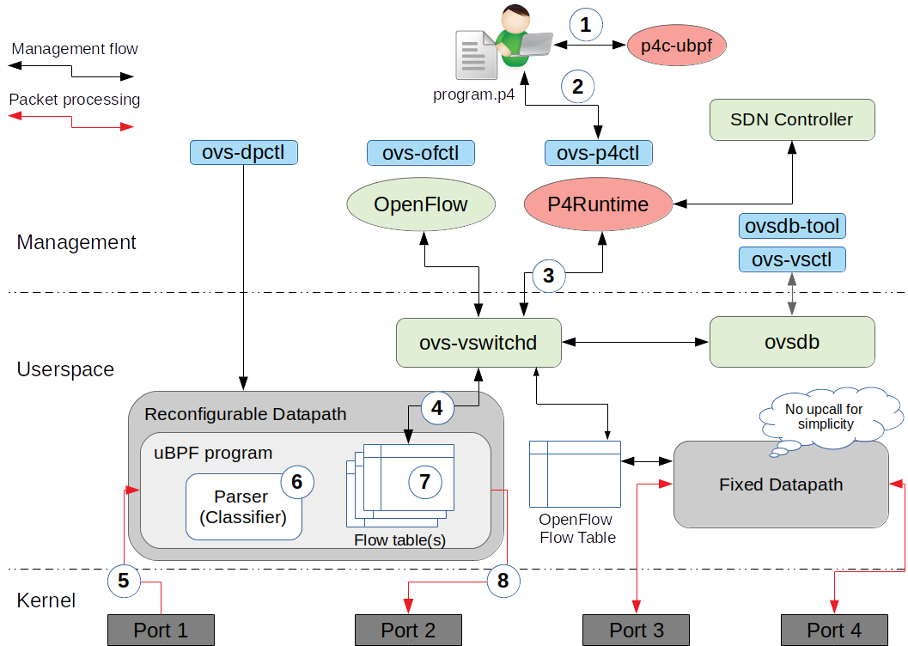
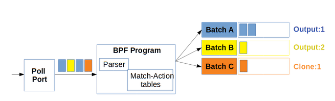
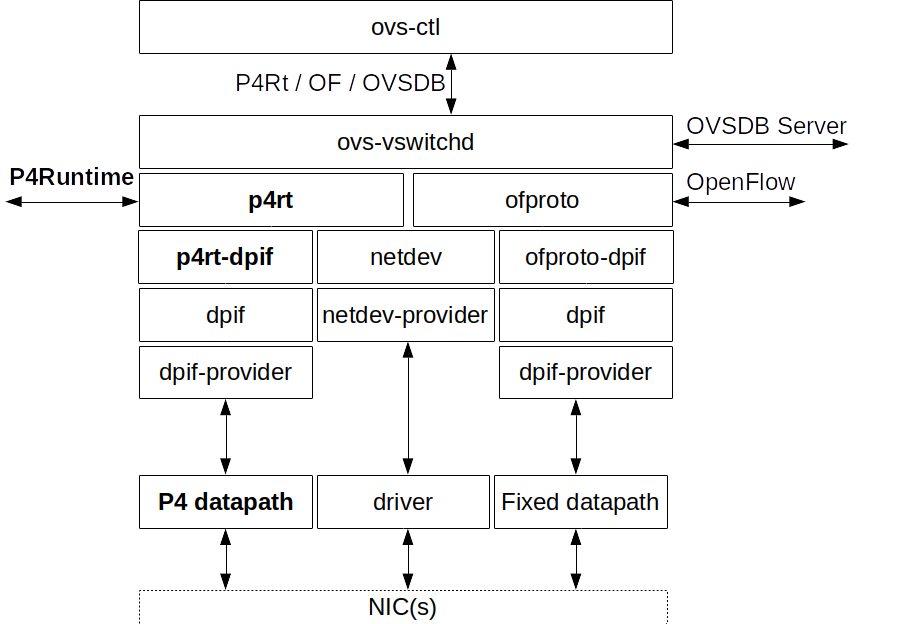
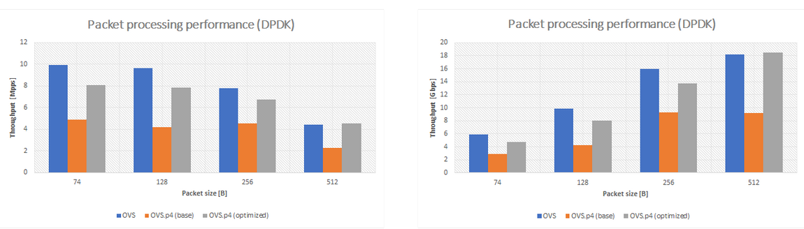

# Design document

Open vSwitch is a high-performance programmable virtual switch, which was created over 10 years ago as the OpenFlow switch. Through these years it achieved maturity and production readiness.
P4-OvS is a new flavor of Open vSwitch that supports user-configurable, protocol-independent (P4) datapath.

P4-OvS is heavily based on Open vSwitch. I have decided to leverage Open vSwitch as a foundation for a new P4 software switch due to the following reasons:

* Open vSwitch has already support for fast kernel by-pass solutions such as DPDK or AF_XDP. Therefore, this portion of code can be re-used.
* Open vSwitch implements lightweight and mature database called OVSDB. Again, OVSDB can be re-used to store & sync a state of P4 software switch.
* The usage model verified by the community.

The open question is whether P4-OvS should become a part of the Open vSwitch project or evolve into a new open-source project. Until this decision will be made, P4-OvS is considered to be a hybrid (OpenFlow + P4Runtime) solution, what affects design choices described in this document.

## Prerequisites

* If you are not familiar with the design and implementation of Open vSwitch it is highly recommended to read [the OVS documentation](http://docs.openvswitch.org/en/latest/).

## Design assumptions

* **Backward compatibility and seamless integration with OpenFlow** - users should be still able to use well-known, existing features of Open vSwitch. P4 support should be rather an option.
* **P4 program per bridge** - Open vSwitch allows to run multiple OVS bridges created by the same OVS instance. The P4-OvS introduces a new bridge type, called "P4 bridge". Each P4 bridge has its own P4 program that describes the data plane features of the bridge.
* **Keep modularity of Open vSwitch** - the architecture of Open vSwitch is modular and allows to integrate new OpenFlow datapaths easily. The design and implementation of P4-OvS should also follow the modular approach.
* **Support for Portable Switch Architecture (PSA)** - P4-OvS is not going to propose yet another P4 architecture model. On the contrary, I want to leverage already existing and well-documented [PSA architecture](https://p4.org/p4-spec/docs/PSA.html).
* **P4Runtime as control interface** - OpenFlow is not extensible and is not able to support P4. I do not believe that the translation between P4 and OpenFlow is possible. Therefore, P4-OvS (P4 bridges exactly) will expose P4Runtime-based control interface to external applications (controllers).

## Architecture

As said before, the idea of P4-OvS is to extend Open vSwitch with the support for P4-capable datapath and P4Runtime interface, but
keep (at least for the first version) the well-known features of Open vSwitch and the OpenFlow programming model. 

Therefore, the architecture of P4-OvS is heavily based on the OVS abstractions. From the functional point of view P4-OvS extends a base Open vSwitch with four new blocks:

* **Reconfigurable (or P4) datapath** - the new, big component is responsible for handling incoming packets to ports associated with P4 bridge. It should allow to inject a new packet processing pipeline (generated from the P4 program) at runtime. The reconfigurable datapath exposes interface to manage P4 programs and control P4 objects (e.g. P4 tables, registers, etc.). The example of reconfigurable datapath can be eBPF, XDP or uBPF.
* **P4Runtime interface** - this functional block provides an abstraction layer between reconfigurable datapath and external controllers. In particular, it implements gRPC server (with P4Runtime protocol definition) and allows users to control P4 datapath.
* **P4 compiler** - even though the P4 compiler is going to be implemented in a separate repository it is also a part of functional architecture. Users leverage the P4 compiler to generate datapath-specific binary from the P4 program and P4Info metadata file for P4Runtime interface.
* **ovs-p4ctl** - the management utility for the P4 bridge. It manages P4 programs and controls P4 objects. The other management tasks (e.g. adding new port) are still implemented by other OVS utility tools (e.g. ovs-vsctl).

<p align="center">

</p>

### Reconfigurable datapath

So far, the two following datapaths are taken into consideration:

* **userspace Berkeley Packet Filter (uBPF)** - the userspace re-implementation of eBPF. It provides uBPF Virtual Machine, where the arbitrary BPF bytecode can be 
injected at runtime. uBPF works well with userspace datapath and kernel by-pass solutions such as DPDK/AF_XDP.
* **eXpress DataPath (XDP)** - the in-kernel fastpath provided by XDP can also be used as reconfigurable datapath for P4-OvS. There is the [p4c-xdp](https://github.com/vmware/p4c-xdp) compiler, which enables
translation from P4 to XDP-compatible BPF bytecode. 

Due to modular design it should be possible to integrate a new reconfigurable datapath (e.g. FPGA). 

#### uBPF datapath

The PoC version of P4-OvS implements uBPF datapath. Even though it has some implementation quirks it shows the general idea to use uBPF as the default P4 datapath. 
The PoC implementation is based on the `netdev` datapath. The `netdev` datapath relies on batched packet processing and PMD threads to poll packets from network interfaces.
uBPF follows the same approach. However, in case of uBPF packet classification and other operations on packets are performed inside uBPF program (called for every incoming packet).
This has some implications on the implementation. First of all, `netdev` makes use of caching architecture (EMC, SMC caches) to accelerate packet classification.
On the contrary, the uBPF datapath cannot re-use cache-based classifier and relies on packet classifier generated by p4c-ubpf. Furthermore, `netdev` creates per
flow packet batches. In case of uBPF packet batches should be constructed per action. The general view on packet processing for uBPF is presented below. 

<p align="center">

</p>

### Interoperability with OpenFlow bridges

P4-OvS has been designed to keep well-known features of Open vSwitch. Therefore, I also have worked on providing the 
interoperability model with OpenFlow bridges.

<p align="center">

</p>

The above figure presents a scenario, in which we have a heterogeneous deployment i.e. both P4Runtime and OpenFlow bridges are 
configured for the instance of Open vSwitch. On the right-hand side there are two OpenFlow bridges connected via a patch port.
Patch port is a well-known concept from OVS and it provides the lightweight way connect two OpenFlow bridges with no need for
using vEth pairs. It is also more efficient then vEth. For P4Runtime bridges I'll use the same concept. The P4-OvS will implement
support for patch ports, so that there will be no need to use vEth to connect two P4Runtime bridges. The figure presents also the way
how OpenFlow and P4Runtime bridge can be connected to each other. In such case, we need to use vEth pair to connect them, because
`br-p41` and `br-of1` use different datapath types (e.g. 'ubpf' and 'netdev', respectively). 

## Implementation architecture

OVS comes with layered, extensible architecture. When it comes to the implementation of OpenFlow abstraction 
there are two main "interfaces": `ofproto-provider.h` and `dpif-provider.h`. The former specifies OpenFlow switch 
abstraction. The latter specifies the OpenFlow datapath interface - the set of actions that a OpenFlow datapath should implement. 

P4-OvS should have similar design. However, to avoid code duplication P4-OvS uses `dpif-provider.h` and extends it with P4-specific functions, 
which should not be implemented by an OpenFlow datapath. P4-OvS implements only a new `p4rt-provider.h`, which provides P4Runtime switch abstraction. 

<p align="center">

</p>

## Implementation decisions

### Port allocation

The OpenFlow version of Open vSwitch differentiates datapath-level port numbers and OpenFlow-level port numbers. 
The `ofproto-dpif` provides the mapping between OpenFlow ports and datapath-level ports. In case of P4 we cannot 
do such a mapping, because a port number can be used explicitly in a P4 program, which uses port numbers at the datapath level.
Therefore:

- if a user doesn't specify a port number when adding it by using `ofport_request` a port number will be automatically allocated by 
a datapath.
- if a user specifies a port number P4-OvS will try to allocate the given port number in the datapath. 

The natural consequence of above is that a port number must be unique across Open vSwitch. In case of classic Open vSwitch
a port number must be unique for a given bridge. For P4-OvS a user must request port number, which is not used by any of P4 bridge.

**Note!** If a user will specify a port number, which is already in use P4-OvS will return an error and will allocate a new port number.

### Support for multiple P4 programs

According to the requirements each P4 bridge should have its unique, independent P4 program. The P4Runtime specification
uses the `device_id` field to distinguish different P4 devices controlled by the same P4Runtime server. **In case of P4-OvS
each P4 bridge is identified by the `device_id`**. This approach makes P4-OvS in line with P4Runtime specification.

**Note!** The PoC version uses `device_id` to identify P4 program at the datapath level too. 
It works as far as we use only one P4 datapath (e.g. uBPF).
For further releases there should be the mapping between `device_id` and `program_id` used by datapath provided. 

## Usage

P4-OvS follows the usage model of Open vSwitch. The bridge and ports are configured with `ovs-vsctl`. 
In order to use a new "P4 bridge" the new `p4` flag, datapath type (only `ubpf` allowed in the PoC) and the path to target binary must be passed to `add-br` command. 

`ovs-vsctl add-br br0 -- set bridge p4=true datapath_type=ubpf other_config:program="<PATH-TO-P4-PROGRAM>"`

The above command will create OVS bridge of type "P4" with uBPF datapath and will inject the target binary (uBPF bytecode)
to the uBPF datapath, so that packets can be handled by a user-configured pipeline. Then, a user can simply add ports to a bridge.

The `ovs-ofctl` tool should be disabled for a P4 bridge, for example:

```bash
ovs-ofctl dump-flows br0
ERROR: OpenFlow tools are disabled for P4-capable bridge br0
``` 

**Note!** The current version informs a user by returning the below message if `ovs-ofctl` is used for P4 bridge.
For P4 bridge `ovs-ofctl` will just not work as P4 bridge does not expose OpenFlow interface. 

```bash
ovs-ofctl: br0 is not an OpenFlow bridge or a socket
```

The `ovs-p4ctl` should be used to manage and configure P4Runtime-based OVS bridge. The example commands could look as follows:

```bash
ovs-p4ctl --help
ovs-p4ctl: P4Runtime switch management utility
For P4Runtime switches:
  show SWITCH                       show P4Runtime information
  dump-tables SWITCH                print table stats
  dump-table SWITCH TABLE           print table information
  
  add-pipe SWITCH                   inserts P4 program to the switch
  set-pipe  SWITCH                  inserts and activates P4 program
  get-pipe  SWITCH                  gets current P4 program
  
  add-entry SWITCH TABLE <ENTRY>    adds table entry
  del-entry SWITCH TABLE <MATCH>    deletes table entries with given MATCH
  dump-entry SWITCH TABLE           prints table entries of TABLE

```

## Test results

The performance of P4-OvS has been preliminary tested and the results are shown below. With prototyped version of uBPF datapath it is able to achieve
a bit worse throughput than OVS-DPDK. Note that DPDK configuration could not be optimal and performance could be tuned, but the same environment was used for both
OVS-DPDK and P4-OvS.

<p align="center">

</p>

## Use cases

Where do I see the application for a high-performance P4 software switch?

* **Extensible, customizable hypervisor switch** - Open vSwitch is widely used as a hypervisor switch (e.g. for OpenStack). 
The user-configurable version could also be used as a hypervisor switch and it will allow cloud providers to customize their
network on demand and innovate faster.
* **Low cost, programmable "bare metal" switch on commodity server** - with constantly changing users' demands the network 
fabric must be customized and a new network features must be deployed on demand. The P4-OvS may be a foundation for a low-cost, 
programmable network switch for DC fabric.
* **Data plane components of VNFs** - the VNF providers may use P4-OvS to build high-performance data plane
of VNFs (e.g. 5G UPF). 

## Appendix A - Implementation

In this section the implementation-specific aspects are described. 

The following modifications have been applied to original OVS code to enable P4 datapath:

* The new parameter (`p4`, boolean type) has been added to the database model of OVS Bridge. 

* New directory (`p4rt/`) added. It contains P4- and P4Runtime-related files (e.g. implementation of P4Runtime abstractions, and P4Runtime provider). 

* The `struct bridge` in `bridge.c` has been extended with the new field `struct p4rt *p4rt`, which represents P4Runtime switch abstraction (similar to `struct ofproto` and OpenFlow switch abstraction).

* The bridge may be of either type "P4" or "OpenFlow" (bot not both). Thus, in the `bridge.c` there are `if-else` statements that checks, whether bridge is of type P4. The OpenFlow-specific functions are "blocked" for P4 bridge.

* `dpif-netdev.c / create_dp_netdev()` - the memory allocation has been moved outside the `create_dp_netdev()` function (to `construct_dp_netdev()`),
to allow `dpif-ubpf` to re-use a part of `dpif-netdev`. Basically, for the sake of fast prototyping some `dpif-netdev.c` structs and functions has been moved to `dpif-netdev.h`, what 
probably is not the best idea and is not a target solution. 

* The `dpif-provider` is shared between OpenFlow datapath interface and P4Runtime datapath interface. The `struct dpif_class`
has been extended with functions dedicated only for P4 (reconfigurable) datapath. These functions should not be implemented by OpenFlow datapath interface.

